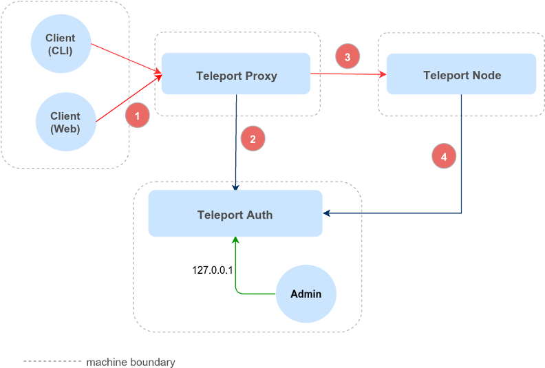
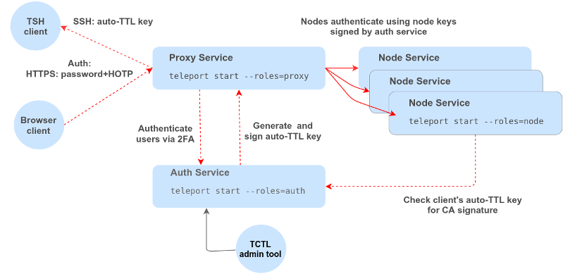
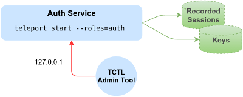

# Architecture

This document covers the underlying design principles of Teleport and offers the detailed 
description of Teleport architecture.

### Design Principles

Teleport was designed in accordance with the following design principles:

* **Off the Shelf Security**. Teleport does not re-implement any security primitives
  and uses well-established, popular implementations of the encryption and network protocols.

* **Open Standards**. There is no security through obscurity. Teleport is fully compatible
  with existing and open standards and other software, including OpenSSH.

* **Cluster-oriented Design**. Teleport is built for managing clusters, not individual
  servers. In practice this means that hosts and users have cluster memberships. Identity 
  management and authorization happen on a cluster level.

* **Built for Teams**. Teleport was created under an assumption of multiple teams operating
  on several disconnected clusters, for example production-vs-staging, or perhaps
  on a cluster-per-customer or cluster-per-application basis.

### Core Concepts

There are three types of services (roles) in a Teleport cluster. 

| Service(Role)  | Description
|----------------|------------------------------------------------------------------------
| node   | This role provides the SSH access to a node. Typically every machine in a cluster runs `teleport` with this role. It is stateless and lightweight.
| proxy  | The proxy accepts inbound connections from the clients and routes them to the appropriate nodes. The proxy also serves the Web UI.
| auth   | This service provides authentication and authorization service to proxies and nodes. It is the certificate authority (CA) of a cluster and the storage for audit logs. It is the only stateful component of a Teleport cluster.

Although `teleport` daemon is a single binary, it can provide any combination of these services 
via `--roles` command line flag or via the configuration file.

In addition to `teleport` daemon, there are three client tools you will use:

| Tool           | Description
|----------------|------------------------------------------------------------------------
| tctl    | Cluster administration tool used to invite nodes to a cluster and manage user accounts. `tctl` must be used on the same machine where `auth` is running.
| tsh     | Teleport client tool, similar in principle to OpenSSH's `ssh`. Use it to login into remote SSH nodes, list and search for nodes in a cluster, securely upload/download files, etc. `tsh` can work in conjunction with `ssh` by acting as an SSH agent.
| browser | You can use your web browser to login into any Teleport node, just open `https://<proxy-host>:3080` (`proxy-host` is one of the machines that have proxy service enabled).

### High Level Overview

Lets explore how these services come together and interact with Teleport clients and with each other. 
Lets look at this high level diagram illustrating the process:

Notice that the Teleport Admin tool must be physically present on the same machine where
Teleport Auth is running. Adding new nodes or inviting new users to the cluster is only
possible using this tool.

Once nodes and users (clients) have been invited to the cluster, lets go over the sequence
of network calls performed by Teleport components when the client tries to connect to the 
node.

1. The client tries to establish an SSH connection to a proxy using either the CLI interface or a 
   web browser (via HTTPS). Clients must always connect through a proxy for two reasons:

   * Individual nodes may not always be reacheable from "the outside".
   * Proxies always record SSH sessions and keep track of active user sessions. This makes it possible
     for an SSH user to see if someone else is connected to a node he is about to work on.

   When establishing a connection, the client offers its public key.

2. The proxy checks if the submitted public key has been previously signed by the auth server. 
   If there was no key offered (first time login) or if the key certificate has expired, the 
   proxy denies the connection and asks the client to login interactively using a password and a 
   2nd factor.

   Teleport uses [Google Authenticator](https://support.google.com/accounts/answer/1066447?hl=en) 
   for the two-step authentication.

   The password + 2nd factor are submitted to a proxy via HTTPS, therefore it is critical for 
   a secure configuration of Teleport to install a proper HTTPS certificate on a proxy. 
   **DO NOT** use the self-signed certificate installed by default.

   If the credentials are correct, the auth server generates and signs a new certificate and returns
   it to a client via the proxy. The client stores this key and will use it for subsequent 
   logins. The key will automatically expire after 22 hours. In the future, Teleport will support
   configurable TTL of these temporary keys.

3. At this step, the proxy tries to locate the requested node in a cluster. There are three
   lookup mechanism a proxy uses to find the node's IP address:

   * Tries to resolve the name requested by the client.
   * Asks the auth server if there is a node registered with this `nodename`.
   * Asks the auth server to find a node (or nodes) with a label that matches the requested name.

   If the node is located, the proxy establishes the connection between the client and the
   requested node and begins recording the session, sending the session history to the auth
   server to be stored.

4. When the node receives a connection request, it too checks with the auth server to validate 
   the submitted client certificate. The node also requests the auth server to provide a list
   of OS users (user mappings) for the connecting client, to make sure the client is authorized 
   to use the requested OS login.
   
   In other words, every connection is authenticated twice before being authorized to log in:

   * User's cluster membership is validated when connecting a proxy.
   * User's cluster membership is validated again when connecting to a node.
   * User's node-level permissions are validated before authorizing him to interact with SSH 
     subsystems.

**Detailed diagram of a Teleport cluster**

Lets explore each of the Teleport services in detail.

### The Auth Service

The `auth server` is the core of the Teleport cluster. It acts as a sertificate authority (CA)
of the cluster.

On first run the auth server generates a public / private keypair and stores it in the 
configurable key storage. The auth server also keeps the records of what has been happening
inside the cluster: it stores recordings of all SSH sessions in the configurable events 
storage.

#### Auth API

When a new node (server) joins the cluster, a new public / private keypair is generated for that node, 
signed by the CA. To invite a node, the auth server generates a disposable one-time token which
the new node must submit when requesting its certificate for the first time.

Teleport cluster members (servers) can interact with the auth server using the Auth API. The API is 
implemented as an HTTP REST service running over the SSH transport, authenticated using host 
certificates previously signed by the CA.

All node-members of the cluster send periodic ping messages to the auth server, reporting their
IP addresses, values of their assigned labels. The list of connected cluster nodes is accessible
to all members of the cluster via the API.

Clients cannot connect to the auth API directly (because client computers do not have valid 
cluster certificates). Clients can interact with the auth API only via Teleport proxy.

Cluster administration is performed using `tctl` command line tool.

**Production note:** For high availability a Teleport cluster can be serviced by multiple auth servers 
running in sync. Check [HA configuration]() in the Admin Guide.
